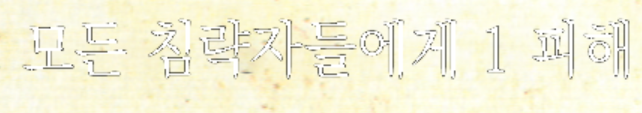
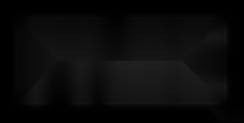

# CharacterRemover
## Summarization
Easy way to remove characters from image.   
## How to Use
__Step 1__: choose image  
  
__Step 2__: drag to select region to remove characters  
  
__Step 3__: space bar(' '): remove characters inside the region
- s: Save('output.png')
- z: Redo
- esc: Close window
## Method Used
### cv2.dilate
Image can be anti-aliased, so we need to cover this by sizing up.  
  
  wrong detecting example below
  

### cv.inpaint
Main method to remove characters  
  
  
## Demo
[Image From](https://www.textstudio.com/word-logos/free-5283/)

  
  After Removing Charaters

